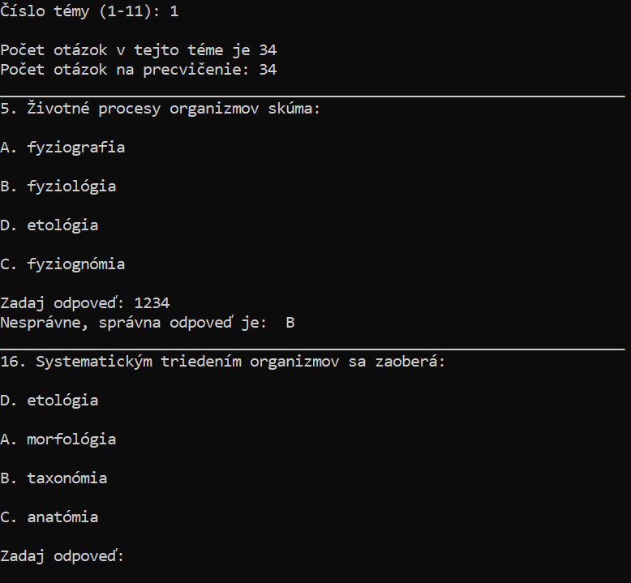

### Testovnica na prijímacie skúšky LF/FZV

  
  

## Popis aplikácie

Aplikacia je navrhnutá pre prípravu na prijímacie skúšky na SZU. Obsahuje tri hlavné módy pre predmety Biológia (BIO) a Chémia (CHE).

### 1. Generátor

V tomto móde si môžete vybrať otázky podľa tém a určiť počet otázok.

- **Biológia (BIO)**
- **Chémia (CHE)**

  

Po prejdení otázok sa nesprávne zodpovedané otázky zapíšu do súboru `incorrect.txt`. Tento súbor je možné vytlačiť alebo skopírovať do aplikácií ako Anki, Quizlet alebo Remnote.

### 2. Simulátor

Tento mód simuluje reálne prijímacie skúšky. Otázky sú vyberané náhodne a môžete si nastaviť počet otázok (odporúčané je 80 otázok pre BIO a 80 otázok pre CHE). Tento mód tiež obsahuje časovač nastavený na 150 minút.

Otázky sú generované do .txt súboru ako:
*random_order.txt*
*random_order_answers.txt*

Tento mód je možné použiť aj na vytlačenie si podkladov do školy, kde nie sú dovolené elektronické zariadenia. :D 

  

  

### 3. Príklady

V tomto móde si môžete vybrať príklady na precvičenie z rôznych okruhov.

- **Biológia (BIO)**
- **Chémia (CHE)**

## Špeciálne módy

### Reakcie

V tomto móde sa reakcie zobrazia vo formáte PDF. Vypracovať všetky, je ich málo. Správne odpovede na poslednej strane. 

## Pokyny

1. Všetky súbory musia zostať v priečinku, aplikácia z nich číta alebo do nich píše.
