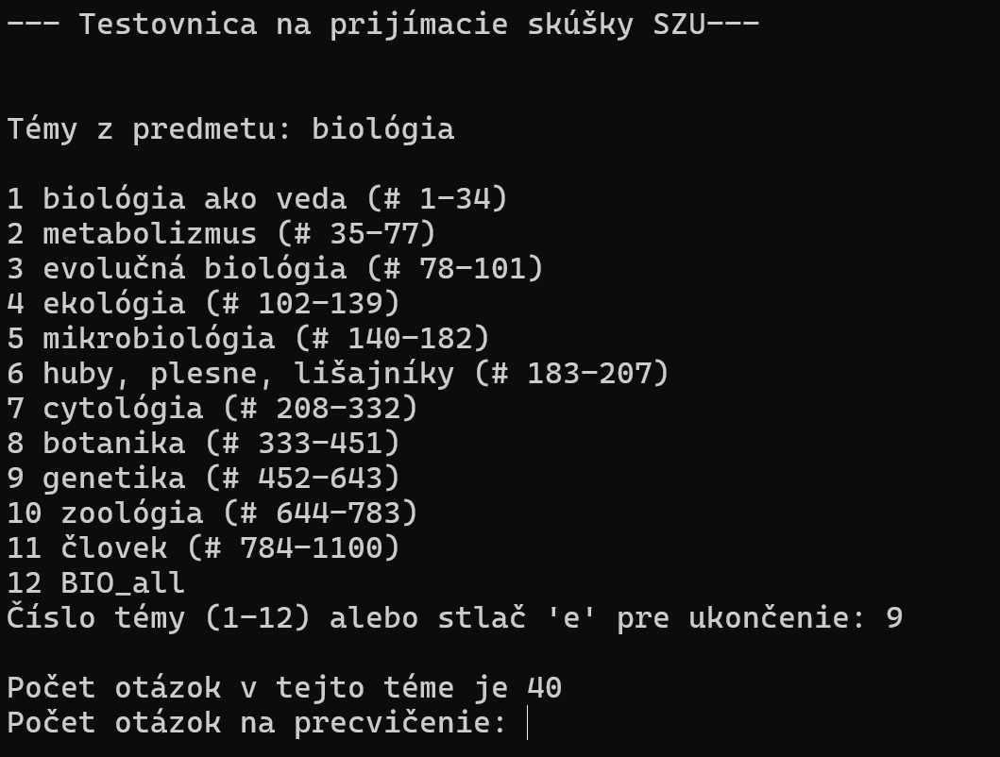
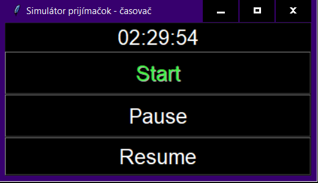
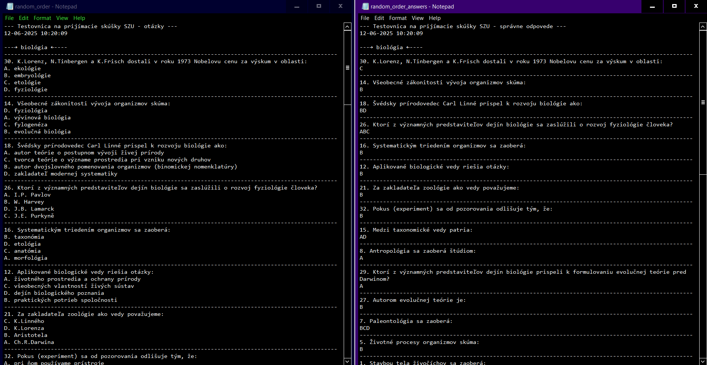

### Testovnica na prijímacie skúšky LF/FZV

  

## Popis aplikácie

Aplikacia je navrhnutá pre prípravu na prijímacie skúšky na SZU. Obsahuje tri hlavné módy pre predmety Biológia (BIO) a Chémia (CHE).

### 1. Generátor

V tomto móde si môžete vybrať otázky podľa tém a určiť počet otázok.

- **Biológia (BIO)**
- **Chémia (CHE)**

  

### 2. Simulátor

Tento mód simuluje reálne prijímacie skúšky. Otázky sú vyberané náhodne a môžete si nastaviť počet otázok (odporúčané je 80 otázok pre BIO a 80 otázok pre CHE). Tento mód tiež obsahuje časovač nastavený na 150 minút.

Otázky sú generované do .txt súboru ako:
random_order.txt
random_order_answers.txt

  

  

- **Biológia (BIO)**
- **Chémia (CHE)**

### 3. Príklady

V tomto móde si môžete vybrať príklady na precvičenie z rôznych okruhov.

- **Biológia (BIO)**
- **Chémia (CHE)**

## Špeciálne módy

### Reakcie

V tomto móde sa reakcie zaznamenávajú do súboru Word. Tento mód je potrebné ešte otestovať pomocou náhodných čísel.

## Pokyny

1. Všetky súbory musia zostať v priečinku, aplikácia z nich číta alebo do nich píše.
2. Po prejdení otázok sa nesprávne zodpovedané otázky zapíšu do súboru `incorrect.txt`. Tento súbor je možné vytlačiť alebo skopírovať do aplikácií ako Anki, Quizlet alebo Remnote.

## Simulácia skúšobných podmienok

Aplikácia simuluje skúšobné podmienky s časovým limitom 150 minút a odporúčaným počtom otázok 80 pre BIO a 80 pre CHE. Po dokončení skúšky si môžete skontrolovať správnosť svojich odpovedí pomocou súboru `incorrect.txt`.

## To-Do

1. Skript so základnými inštrukciami a otváraním viacerých skriptov:
    - Otvoriť prvý skript ako "w" (write), druhý a tretí ako "a" (append).
2. Ak sa rozhodnete pre automatickú korekciu odpovedí v PC, použite rovnakú stratégiu, ale neukladajte výsledky do `.txt` súboru.
